# Architecture

The mandatory first step for any decision-driven code change, and the orchestrator of the **full lifecycle** from a freeform prompt: frame → size → place → (brainstorm → approve → plan → plan-review) → implement → review → fix. You do NOT generate a file path, pick a layer, or open the authoritative flow docs yourself — this skill routes you through the right sub-skills in the right order. Skipping it is how code lands in the wrong layer and how non-canonical files (`changes.ts`, `manager.ts`, `helpers.ts`) get invented.

**Letter vs spirit:** entering this skill and then free-handing the decision anyway is a violation. Run the steps.

**Trivial vs non-trivial** (`docs/code/glossary.md`): a **trivial in-place edit** — one existing file, no new file, no new public surface, no layer crossing — skips this skill. Everything else is **non-trivial** and runs the full flow below: design → approval → written plan → plan review → implementation → mandatory review → fix loop. If you're unsure, it's non-trivial.

## Orchestration order

```mermaid
flowchart TD
    Frame{"Can I frame the change in ONE sentence<br/>using ONE layer's vocabulary?"}
    Storm["Run event storming<br/>(docs/abstract/event-storming.md)"]
    Probe["Step 1.5 — size probe<br/>(docs/abstract/simple-vs-easy.md):<br/>measure radius, judge braid"]
    ProbeGate{"Radius contradicts the frame,<br/>OR the change adds braid?"}
    ProbeStop["STOP → report radius + braid →<br/>2-3 options with costs → user decides"]
    Place["Invoke code-placement skill —<br/>pick layer + canonical file"]
    IsDomain{"Layer == domains?"}
    IsFeature{"Layer == features / route host?"}
    Domain["Invoke domain-development skill"]
    Feature["Invoke feature-development skill"]
    Other["aggregate / widget / shared:<br/>follow project-structure.md section"]
    IsReact{"React code involved?"}
    React["Invoke react-best-practices skill"]
    Brainstorm["Delegate to superpowers:brainstorming<br/>(+ project context) → design in docs/_plans/"]
    Approve{"User approves the design?<br/>(brainstorming HARD-GATE)"}
    Plan["Delegate to superpowers:writing-plans<br/>(+ project context) → docs/_plans/&lt;topic&gt;-plan.md"]
    PlanReview["Step 5 — plan review pass<br/>(fresh context, one at a time)"]
    PlanGate{"Gaps found?"}
    CapGate{"4 passes already run?"}
    Surface["Surface remaining findings<br/>→ user decides"]
    PlanFix["Revise plan<br/>(superpowers:writing-plans)"]
    Write["Write the edit directly (terminal)"]
    Implement["Step 6 — implement: delegate to<br/>superpowers:subagent-driven-development<br/>(current branch, + project context)"]
    DevGate{"Discovery invalidates the plan?"}
    Amend["HARD STOP → present 2-3 options →<br/>amend docs/_plans/&lt;topic&gt;-plan.md<br/>(superpowers:writing-plans)"]
    ReApprove{"User approves the amendment?"}
    Review["Step 7 — invoke project reviewer skill<br/>→ docs/_reviews/&lt;topic&gt;-review.md"]
    IssuesGate{"Blocking / major findings?"}
    Done["Done — minors surfaced;<br/>finishing (merge/PR) is manual"]

    Frame -- no --> Storm
    Frame -- yes --> Probe
    Storm --> Probe
    Probe --> ProbeGate
    ProbeGate -- yes --> ProbeStop
    ProbeGate -- no --> Place
    ProbeStop --> Place
    Place --> IsDomain
    IsDomain -- yes --> Domain
    IsDomain -- no --> IsFeature
    IsFeature -- yes --> Feature
    IsFeature -- no --> Other
    Domain --> IsReact
    Feature --> IsReact
    Other --> IsReact
    IsReact -- yes --> React
    IsReact -- no --> Gate
    React --> Gate
    Gate{"Non-trivial?"}
    Gate -- "no (trivial)" --> Write
    Gate -- yes --> Brainstorm
    Brainstorm --> Approve
    Approve -- "no, revise" --> Brainstorm
    Approve -- yes --> Plan
    Plan --> PlanReview
    PlanReview --> PlanGate
    PlanGate -- yes --> CapGate
    CapGate -- "no" --> PlanFix
    CapGate -- "yes (cap)" --> Surface
    Surface --> Implement
    PlanFix --> PlanReview
    PlanGate -- no --> Implement
    Implement --> DevGate
    DevGate -- "yes (hard stop)" --> Amend
    DevGate -- no --> Review
    Amend --> ReApprove
    ReApprove -- "no, revise" --> Amend
    ReApprove -- yes --> PlanReview
    Review --> IssuesGate
    IssuesGate -- yes --> Amend
    IssuesGate -- no --> Done
```

This is the **full lifecycle from a single freeform prompt**: frame → size → place → (brainstorm → approve → plan → plan-review) → implement → review → fix. On a non-trivial change you never reach implementation until `superpowers:brainstorming` has presented a design, the user approved it, `superpowers:writing-plans` produced the plan in `docs/_plans/`, and **a fresh-context review pass came back clean** (retry on findings, hard cap four passes). Implementation is delegated to `superpowers:subagent-driven-development`; review is the project `reviewer` skill. The `Amend` node is shared by **two** loops — a plan-invalidating discovery mid-implementation (step 6) and a blocking/major review finding (step 8) are the same move: stop, present options, amend the plan, **re-approve**, re-review the plan, re-implement. Every plan change — initial or amendment — passes the same approval gate; the loop is not autonomous. The generic process (clarify → design → plan → execute) is **delegated to superpowers**; this skill adds the project frame and the review/fix gates.

## The steps

1. **Frame it.** State the change in one sentence using one layer's vocabulary. Can't — two vocabularies, or the actor/trigger/post-state is unclear? The model is ambiguous: run event storming (`docs/abstract/event-storming.md`) with the user, then continue. Do not guess the layer.
   **1.5. Size it — the frame is not an estimate.** Framing the change in one sentence is exactly what makes it look easy; the sentence describes the concern, while the cost lives in the braid that concern is already caught in. Run the probe in `docs/abstract/simple-vs-easy.md` **before** brainstorming spends effort on an unmeasured change: measure the blast radius with `findReferences` (files + layers — never guess it), judge whether the change adds or removes braid, and report both in three lines. STOP and hand the user 2-3 costed options when the radius **contradicts the frame** (one layer's vocabulary, three layers of artifact) or when the change **adds braid** — including when the diff is tiny, because that cell is the one nothing downstream catches. A stop is a report, not a refusal: the user decides whether to stage it, decomplect first, or accept it.
2. **Place it.** Invoke `code-placement`. It returns the layer AND the canonical file kind. The closed set of file kinds a `src/domains/` module may contain is defined in `docs/code/project-structure.md` (§ File contracts) and enforced by the PreToolUse hook — this skill does not restate it. No canonical home for your logic → **STOP and ask the user.** Never invent a filename to resolve the ambiguity.
3. **Consult the authoritative flow.** Route by the placed layer and read its guidance — this informs the plan, it is not yet permission to write code:
   - `src/domains/` → `domain-development` skill.
   - `src/features/` or a route hosting a feature → `feature-development` skill.
   - aggregate / widget / shared → the matching section of `docs/code/project-structure.md` (no dedicated skill).
   - Touching components/hooks/rendering → also invoke `react-best-practices`.
4. **Brainstorm, plan, and get approval — BEFORE any implementation** (non-trivial changes; see "Non-trivial changes" below). This is **delegated to superpowers**. A **trivial** in-place edit leaves the flow here: write the edit directly, no plan, no review/fix tail.
5. **Review the plan — until one pass comes back clean, capped at four.** Before handing it downstream, run a fresh-context pass over `docs/_plans/<topic>-plan.md`; findings → fix → next pass, one at a time (see "Reviewing the plan — from an empty session"). A plan that's clear on the first pass is good to go.
6. **Implement.** Only after the design is approved, the plan exists, and the plan review cleared. Delegate to `superpowers:subagent-driven-development` (current branch), carrying the project context. If a discovery invalidates the plan mid-flight → **hard stop and amend** (see "Implementing — handling plan deviations").
7. **Review.** When implementation completes, automatically invoke the project `reviewer` skill — mandatory (see "Reviewing and fixing"). Not optional, not the generic superpowers final review.
8. **Fix loop.** Blocking/major findings → amend the plan, re-approve, re-implement, re-review until mergeable. Minor findings → surface, let the user decide. Finishing (merge/PR) is a separate manual step.

## Non-trivial changes — delegate brainstorming + planning to superpowers

For a non-trivial change (per the glossary), **the plan precedes the implementation — it is not a write-up produced afterward.** Do not write implementation code until the user has approved a design. The generic clarify → design → approval → plan process is **owned by superpowers** (a declared project dependency — see `.claude/settings.json` `enabledPlugins`). This skill does not re-implement it; it injects the project frame and delegates:

**1. Invoke `superpowers:brainstorming`.** It clarifies requirements one question at a time, proposes approaches, presents a design, and **gates on user approval before any implementation** (its HARD-GATE — this is what satisfies the always-stop-for-approval rule). Override its default artifact location: write the design to **`docs/_plans/<topic>-design.md`**, not `docs/superpowers/specs/`.

**2. Invoke `superpowers:writing-plans`.** It turns the approved design into the implementation plan. Override its default artifact location: write the plan to **`docs/_plans/<topic>-plan.md`**, not `docs/superpowers/plans/` — this is the path `reviewer` diffs the implementation against.

**3. Carry this project context INTO both delegated skills** (this is the part superpowers cannot know — without it, it makes generically-reasonable but architecturally-wrong decisions):

- **Placement is a fixed input, not a re-decision.** The layer + canonical file kind returned by `code-placement` are settled. Brainstorming/planning design _within_ that placement; they do not re-pick the layer or invent file structure — the canonical file kinds are the closed set in `project-structure.md`, hard-blocked by the PreToolUse hook.
- **Honor the layer contract.** Import rules, layer boundaries, and the anti-patterns in `docs/code/project-structure.md` constrain every "where does this go / what calls what" decision. Pass the relevant `domain-development` / `feature-development` guidance (from step 3) as the design's ground truth.
- **Use the domain's ubiquitous language.** Naming follows the domain `README.md` glossary — one concept, one name. Don't let the design coin synonyms.
- **Write the plan for an empty session.** The reader is a fresh agent with zero conversation history: no brainstorming transcript, no memory of what was rejected, no idea which file you were just looking at. Everything the implementation depends on is written down _in the plan_ — the problem being solved, the placement decision and why, absolute repo-relative paths for every file touched, the exact symbols/functions involved, the seams to use, the commands to run, and the constraints that came out of discussion. Deictic references to the session ("as discussed", "the approach we picked", "the file above", "the current implementation") are defects — name the thing. Link to `docs/_plans/<topic>-design.md` and the layer docs for background, but the plan must be executable without opening them.
- **State requirement levels in RFC 2119 vocabulary** (`docs/RFC/2119.md`). Every instruction in the plan carries an explicit, capitalized strength — MUST / MUST NOT / SHOULD / SHOULD NOT / MAY — so a fresh implementer can tell a hard constraint from a preference from a free choice without asking. Unmarked prose ("we handle errors here", "probably extract a helper") reads as optional to one agent and mandatory to the next; that ambiguity is what the gate is for. Carry the standard note into the plan: _the key words MUST, MUST NOT, SHOULD, SHOULD NOT, MAY are to be interpreted as described in RFC 2119_.
- **The plan must satisfy the `reviewer` contract.** Beyond superpowers' task breakdown, the plan MUST name: the layers and **canonical files** touched, what is `must_not_touch` / `out_of_scope`, the seams (DI slots/pipelines/use cases) used, and the verification approach. Scope creep is only detectable if scope was written down.
- **Testing follows project conventions** — vitest `*.spec.ts` / `*.test.tsx` with the project's run command (`npx vitest run <path>`), not the skill's pytest examples.

If superpowers is unavailable (a teammate or CI without the plugin), fall back to running the same substeps inline — clarify with `AskUserQuestion`, write `docs/_plans/<topic>-plan.md`, present it and stop for approval — applying the same project context above. The plan review that follows is unaffected: it runs on `Agent`, not on superpowers, so it applies either way. The dependency is declared so this fallback is rarely needed, not because the gate is optional.

## Reviewing the plan — from an empty session

A plan goes downstream only once **a review pass comes back clean**: pass 1 → findings → fix → pass 2 → … up to a hard cap of four. One clean pass is enough — a plan nobody found a gap in does not need a second opinion to prove it. Passes are **sequential**, never parallel: each reviews the plan _as revised by the previous one_, otherwise the second reviewer audits a document that no longer exists and its findings arrive against stale text.

Every pass runs in **fresh context** — dispatch it as its own subagent (`Agent`) whose inputs are the plan path, the approved design path (`docs/_plans/<topic>-design.md`), and the checklist below. Never review the plan yourself in the authoring context: you know what you meant, so you will read the gaps as filled. That blindness is the whole reason for the gate.

Each pass answers, against `docs/_plans/<topic>-plan.md` **and the actual repo**:

1. **Self-contained?** Could a fresh session execute this with no other context? Flag every deictic reference ("as discussed", "the current approach"), every unnamed file/symbol, every step whose input comes from nowhere.
2. **Unambiguous?** Does every instruction state its requirement level in RFC 2119 terms (`docs/RFC/2119.md`)? Flag prose whose strength has to be guessed — an implementer must never have to infer whether a step is mandatory, recommended, or optional.
3. **Real?** Do the named paths, symbols, seams (DI slots/pipelines/use cases), and commands actually exist? A plan that references an imagined export fails at task 1.
4. **Complete?** Does executing every task in order produce the stated outcome — no missing wiring, registration, migration, or test? Are `must_not_touch` / `out_of_scope` and the verification commands stated?
5. **Architecturally sound?** Placement, layer/import contract, canonical file kinds, ubiquitous language (`docs/code/project-structure.md`, the domain `README.md`).
6. **Sized honestly?** The plan enumerates every file it touches — so compare that list against the step-1.5 probe and against the one-sentence frame. Flag a plan whose file/layer count contradicts the frame it came from, and flag a plan that quietly adds braid the design never named (a new flag on a shared path, a parameter threaded through callers that have no use for it). This is the mechanical second net under the probe: at step 1.5 the radius was estimated, here it is enumerated (`docs/abstract/simple-vs-easy.md`).
7. **Faithful to the approved design?** The plan implements `docs/_plans/<topic>-design.md` — the design the user approved at the brainstorming gate. A plan can be self-contained, real, complete, and architecturally sound while quietly solving a different problem than the one signed off. Flag every divergence: a dropped requirement, an added one, a swapped approach.

Pass 1 covers the whole checklist. Any pass after it must not be a copy of the one before — shift the emphasis (e.g. pass 1 executability/self-containment, pass 2 architecture/scope/design-fidelity), so consecutive reviewers don't share one blind spot. Each returns findings or "no gaps".

**Handling a design divergence (criterion 7).** Judge how much steering it takes:

- **Light** — the plan's departure is forced by something the design didn't know (a seam that doesn't exist, a constraint discovered in the repo) and the fix is obvious within the approved intent. **Justify the design against that new input yourself**: record the divergence and its cause in the plan, keep going. No user round-trip.
- **Anything more** — the departure changes what gets built, which requirement is met, or which approach is taken. **HARD STOP.** Present the divergence to the user, name what in the design no longer holds and why, and offer concrete ways to resolve it (revise the design, revise the plan back toward the design, accept the divergence). Wait for the answer.

If you're unsure which side it falls on, it's the second.

The loop:

1. Run one pass. It returns findings or "no gaps".
2. Findings → revise `docs/_plans/<topic>-plan.md` via `superpowers:writing-plans`, then go to 1 with the next pass (a fresh reviewer, new emphasis, reading the revised plan).
3. No findings → the gate is clear, whether that was pass 1 or pass 3.
4. **Hard cap: four passes.** If pass 4 still returns findings, stop reviewing — surface the outstanding findings to the user with your read on each and let them decide (fix, accept, or rethink the plan). Reviewers always find _something_; the cap is what stops the gate from becoming an infinite polish loop.

The rule is one clean pass, not a pass count: **the last pass must come back clean** — a plan still collecting findings on its final review has not been reviewed, only edited. The one exception is the cap: at pass 4 the outstanding findings go to the user instead of into another round. Up to that point the loop is not user-gated (unlike design approval).

**Amendments re-enter the gate, scoped to what changed.** An amendment that changes scope, placement, or approach gets a full pass over the whole plan. An amendment that only corrects details inside an already-reviewed plan (a renamed symbol, a corrected path, an added test) gets a pass over the changed sections. Either way the same rule applies: clean pass, or fix and go again.

## Implementing — handling plan deviations

Once the plan is approved, implement it by delegating to `superpowers:subagent-driven-development` on the **current branch** (no worktree is mandated; treat the skill's worktree step as optional). Carry the same project-context block into the implementer subagents — placement is fixed, canonical filenames only, layer contract and ubiquitous language hold, tests are vitest.

**The plan is a contract. When implementation reveals it is wrong, you do NOT improvise.** Superpowers' execution skills only escalate open-endedly ("stop and ask the human" on a `BLOCKED` / plan-wrong status); the project requires a sharper move. Trigger a **hard stop** when: an implementer reports `BLOCKED` or `DONE_WITH_CONCERNS` meaning the plan itself is wrong, OR a discovery during implementation invalidates a plan assumption (a seam doesn't exist, the placed file can't hold the logic, a new constraint surfaces), OR **the real blast radius overruns the plan's** — files or layers the plan never listed keep turning out to be mandatory. The last one is the same failure the step-1.5 probe exists to catch, arriving late: an estimate that was wrong is a plan-invalidating discovery, not a reason to keep typing. On trigger:

1. **HARD STOP.** Do not silently deviate from the approved plan or patch around the problem.
2. **Notify the user and present 2-3 concrete amendment options** with trade-offs. This pattern is borrowed from `superpowers:brainstorming` ("propose 2-3 approaches") — superpowers has no dedicated deviation skill, so this is the project's addition, not something to delegate.
3. On the user's choice, **amend `docs/_plans/<topic>-plan.md`** via `superpowers:writing-plans` (update scope, files, seams — keep it the same plan document).
4. **Re-approval gate.** An amendment is a plan change; it passes the same approval gate as the initial plan. There is no standing bypass — present the amended plan, wait for approval.
5. **Re-run the plan review** on the amended plan before resuming — over the whole plan if the amendment changed scope/placement/approach, over the changed sections if it only corrected details (see above).
6. **Resume** `subagent-driven-development` from the affected task.

## Reviewing and fixing

**Step 7 — review (mandatory).** When all plan tasks complete, automatically invoke the project `reviewer` skill. It is **rule-aware** (cites `docs/claude/*-checklist.md`, diffs the implementation against the plan's `must_not_touch` / `out_of_scope` / scope) — this is why it replaces superpowers' generic final review rather than running alongside it. It writes `docs/_reviews/<topic>-review.md` (same `<topic>` as the plan) and returns a verdict with blocking / major / minor counts.

**Step 8 — fix loop.** Route by severity:

- **Blocking / major** → treat exactly like a plan deviation: amend `docs/_plans/<topic>-plan.md` with the fixes via `superpowers:writing-plans`, **re-approve**, **re-run the plan review** (scoped to what the amendment changed — see "Reviewing the plan"), re-implement via `subagent-driven-development`, then re-run `reviewer`. Loop until the verdict is mergeable. (This is the same `Amend → ReApprove → PlanReview → Implement` loop as step 6 — a finding is just another new input.)
- **Minor** → surface to the user; let them choose fix-now vs defer. Do not loop on minors.

Finishing the branch (tests, merge/PR) stays a **separate, user-initiated step** — this skill's lifecycle ends at a clean review verdict, not at a merge.

## Closing the loop — rule extraction

When the user corrects you during planning or implementation in a way that **generalizes** beyond this task ("X always goes in Y", "we don't do Z"), run the rule-extraction pass from `docs/code/rule-extraction.md` before finishing: propose the durable rule, and on approval append it to the matching doc + reviewer checklist (and flag it for a hook if greppable). Skip silently if the user made no substantive corrections. This is what stops the same mistake recurring next session — a correction that isn't captured is one you'll repeat.

## Red flags — you are skipping the process

- **Writing the plan after the code is already written** → the plan is a contract you build _to_, not a summary of what you built. On a non-trivial change the design is approved and the plan lands in `docs/_plans/` _before_ the first implementation edit.
- **Starting to edit implementation files on a non-trivial change before the design was approved** → stop, run `superpowers:brainstorming`, get approval, then `superpowers:writing-plans`.
- **Re-implementing clarify/design/plan prose inside this skill** → that process is delegated to superpowers; this skill only injects the project frame. Don't hand-roll a parallel flow.
- **Restating a list or definition that an authoritative doc owns** (the canonical file kinds, the trivial/non-trivial criteria, layer import rules, per-file contracts) → reference the doc, don't copy it. Duplicated enumerations drift silently when the doc changes. This skill _orchestrates and routes_; `project-structure.md` / `code-placement.md` / `glossary.md` _define_.
- **Letting the delegated skill re-pick the layer, invent a non-canonical filename, or write the plan to `docs/superpowers/`** → placement is fixed by `code-placement`, filenames are the canonical set, and the plan goes to `docs/_plans/`.
- **Handing a plan to implementation without a clean review pass** → every plan gets at least one fresh-context pass, and a pass that returned findings doesn't count until the fixed plan clears one. An amended plan re-enters the gate. Reviewing it yourself in the authoring context does not count either — you can't see the context you're silently supplying.
- **Firing several plan-review passes at once to save a round-trip** → a later pass then reviews a document an earlier one is already invalidating. Pass, fix, pass.
- **A plan that only makes sense to someone who was in this conversation** ("as discussed", "the file above", "the approach we agreed on", an unnamed helper) → the implementer is a fresh session. Name every file, symbol, seam, and command.
- **Improvising around a plan-invalidating discovery mid-implementation** → hard stop, present 2-3 options, amend the plan, re-approve. Silently deviating from an approved plan is the exact failure the gate exists to prevent.
- **A plan that quietly solves a different problem than the approved design** → criterion 7. Light steering (a constraint the design didn't know about): justify it in the plan and continue. Anything that changes what gets built: hard stop and ask the user.
- **Polishing the plan through pass 5, 6, 7…** → the cap is four. Past it, hand the remaining findings to the user instead of looping.
- **Finishing implementation without running the project `reviewer`** → review is the mandatory step-7 gate, not an optional follow-up. The generic superpowers final review does not substitute for it.
- **Looping on review fixes without re-approving the amended plan** → blocking/major findings amend the plan, and every plan change re-passes approval. The fix loop is not autonomous.
- **Treating the one-sentence frame as an estimate** → the sentence describes the concern; the cost is the braid it sits in. Step 1.5 measures the radius with `findReferences` before brainstorming spends effort on it. "It's a one-liner in `dotns`" is a frame, not a size.
- **"It's only a small diff"** → diff size is the _easy_ axis and reports nothing about braid. A three-line flag on a shared path is the most expensive cell in the table, and it is the only one no downstream gate catches (`docs/abstract/simple-vs-easy.md`).
- **"Most of those files are just call-site updates"** → that is the evidence _for_ complecting, not a reason to discount the count. Forty callers threading a value they never asked for is a measurement, and it belongs in front of the user before the first edit.
- **Discovering the real radius at file 60** → it was measurable in seconds at file 0. Late discovery is a hard stop and a plan amendment, not something to push through.
- About to type a path under `src/` without having run `code-placement`.
- Inventing a descriptive filename because nothing fits → that is the signal to STOP and ask, not to name it.
- "It's obvious where this goes" on a multi-file or new-abstraction change → frame and place it anyway; obvious-feeling placements are where layer leaks start.
- Reaching for `domain-development`/`feature-development` before deciding the layer — placement comes first.

## See also

- `docs/abstract/simple-vs-easy.md` — the step-1.5 size probe: blast radius vs braid, the 2×2, the rationalizations.
- `docs/code/glossary.md` — trivial vs non-trivial, blast radius, complecting, peer file, composition, trust boundary.
- `docs/code/project-structure.md` — layer definitions and per-file contracts.
- `docs/code/code-placement.md` — full layer/file decision framework + cut rules.
- `docs/code/architecture.md` — how artifacts interact at runtime.
- `docs/code/rule-extraction.md` — turning a correction into a durable rule.
- `docs/RFC/2119.md` — MUST / SHOULD / MAY, the requirement-level vocabulary plans are written in.
- `reviewer` skill — audits the implementation against the plan and the checklists.
